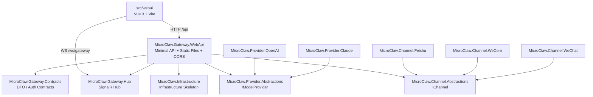
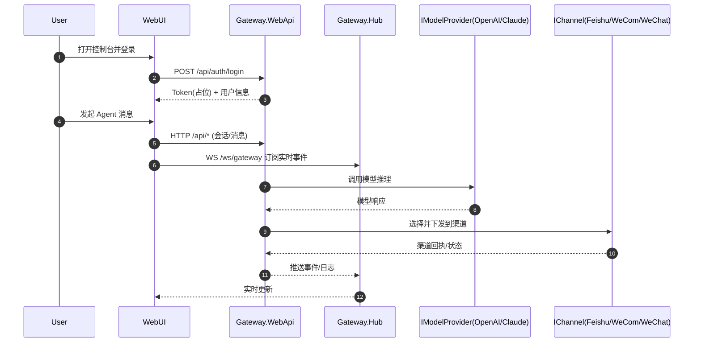

# MicroClaw

MicroClaw 是一个基于 `.NET 10 + Vue 3` 的 AI Agent 控制面项目，当前聚焦先打通核心闭环：

- 登录与权限（MVP 阶段先做基础占位）
- Agent/Session 消息交互
- 实时事件与日志流
- 网关健康状态与基础运维视图

## 仓库结构

- `src/gateway`：后端多项目方案（`MicroClaw.sln`）
- `src/webui`：前端控制台（Vue 3 + Vite + TypeScript）

## 工程说明（按项目）

### Gateway 解决方案（`src/gateway/MicroClaw.sln`）

#### 网关与通信

- `MicroClaw.Gateway.WebApi`
	- 网关主入口（ASP.NET Core Minimal API）
	- 承担 API 暴露、依赖注入、静态资源托管、CORS 配置
	- 当前 API 已按模块拆分到 `Endpoints`，统一挂载在 `/api`
- `MicroClaw.Gateway.Hub`
	- SignalR Hub 定义与实时通信入口
	- 对外 WebSocket 路径：`/ws/gateway`

#### 契约与基础设施

- `MicroClaw.Gateway.Contracts`
	- 网关共享契约（请求/响应 DTO、认证模型等）
	- 供 WebApi、WebUI 交互语义保持一致
- `MicroClaw.Infrastructure`
	- 基础设施层预留（日志、存储、配置扩展等）
	- 当前以骨架项目为主，便于后续能力沉淀

#### Model Provider 模块

- `MicroClaw.Provider.Abstractions`
	- 模型提供方统一抽象（如 `IModelProvider`）
- `MicroClaw.Provider.OpenAI`
	- OpenAI 提供方实现
- `MicroClaw.Provider.Claude`
	- Claude 提供方实现

#### Channel 模块

- `MicroClaw.Channel.Abstractions`
	- 多渠道统一抽象（如 `IChannel`）
- `MicroClaw.Channel.Feishu`
	- 飞书渠道实现
- `MicroClaw.Channel.WeCom`
	- 企业微信渠道实现
- `MicroClaw.Channel.WeChat`
	- 微信渠道实现

### WebUI（`src/webui`）

- 前端控制台（Vue 3 + Vite + TypeScript）
- 负责登录态、会话界面、健康检查与网关交互展示
- 开发期通过 Vite 代理与 Gateway 的 `/api`、`/ws` 连接

## 架构关系图（Mermaid）



## 运行时数据流（Mermaid）



## API 分组说明

Gateway 当前采用 Minimal API 分组映射：

- 统一前缀：`/api`
- 模块拆分：`Health`、`Auth`、`System`
- Swagger 中按标签分组显示（Tags）

当前可用接口：

- `GET /api/health`
- `POST /api/auth/login`
- `GET /api/providers`
- `GET /api/channels`
- `WS /ws/gateway`（SignalR）

## 快速启动（本地开发）

### 1) 启动 Gateway

前置要求：安装 `.NET 10 SDK`。

```bash
cd src/gateway
dotnet restore MicroClaw.sln
dotnet run --project MicroClaw.Gateway.WebApi
```

- 默认地址：`http://localhost:5080`
- Swagger：`http://localhost:5080/swagger`

### 2) 启动 WebUI

前置要求：安装 `Node.js 22+`。

```bash
cd src/webui
npm install
npm run dev
```

默认地址：`http://localhost:5173`

## 当前实现范围（第一批）

- 后端多项目骨架：WebApi、Contracts、Hub、Provider、Channel、Infrastructure
- 网关基础能力：健康检查、登录占位、Provider/Channel 枚举、SignalR Hub
- 控制台基础骨架：路由、布局、网关健康检查页面
- 前后端联通：Vite 代理 `/api`、`/ws` 到 Gateway

## Docker 部署

前置要求：安装 Docker Desktop（含 Compose）。

### 单镜像部署（Gateway 承载 WebUI 静态文件）

```bash
docker compose up -d --build
```

- 统一入口：`http://localhost:5080`
- API 健康检查：`http://localhost:5080/api/health`

## 规划与路线图

- 产品路线图请见：`PRODUCT_ROADMAP.md`
